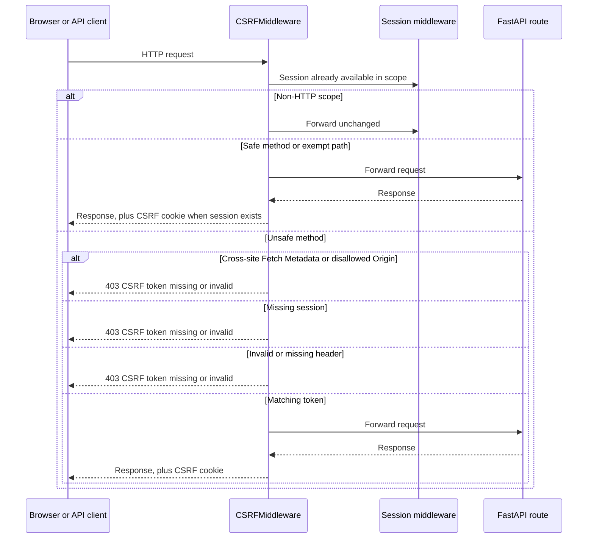

# CSRF Protection

This document describes the backend CSRF protection implemented by [`CSRFMiddleware`](../app/middleware/csrf.py).

## Purpose

The backend uses a synchronizer-token pattern:

1. A random CSRF token is stored in the server-side session.
2. The same token is sent to the browser in the readable `csrf_token` cookie.
3. The frontend reads that cookie and sends the value in the `X-CSRF-Token` header for state-changing requests.
4. The middleware compares the header value with the session value using a constant-time comparison.

A cross-site form can cause a browser to send cookies, but it cannot normally read the CSRF cookie or set this custom header. The request is therefore rejected unless the attacker also knows the token.

Two OWASP-recommended defense-in-depth checks run ahead of the token comparison, on every unsafe, non-exempt request:

1. **Fetch Metadata** - if the browser sends `Sec-Fetch-Site: cross-site`, the request is rejected immediately, before the token is even checked.
2. **Origin verification** - if an `Origin` header is present, it must match one of the configured CORS origins.

Both checks are advisory when their header is absent (older browsers, some proxies), so the token check remains the primary, mandatory defense.

## Why a Cookie, Not a GET Endpoint

OWASP's cheat sheet describes two ways to hand the token to the SPA: a dedicated `GET` endpoint that returns it in a JSON body, or a readable cookie that JavaScript reads directly (used in the _Synchronizer Token_ pattern here and in the _Double-Submit Cookie_ pattern). This implementation uses the cookie:

- A `GET` endpoint requires the SPA to cache the token in JS memory or `localStorage` for later requests; `localStorage` is explicitly discouraged by OWASP because it is readable by any injected script, making the token easier to exfiltrate via XSS than a same-site cookie.
- The cookie is re-issued on every response (see `send_with_csrf_cookie`), so the SPA always has the current token without an extra round trip or client-side cache-invalidation logic.
- The cookie approach keeps the contract stateless from the frontend's perspective: `axios` reads `csrf_token` from `document.cookie` and attaches it automatically (see [`frontend/src/utils/csrf.ts`](../../frontend/src/utils/csrf.ts)), rather than the app having to fetch and thread a token through every request manually.

## Protected Methods

The following methods are treated as safe and do not require CSRF validation:

- `GET`
- `HEAD`
- `OPTIONS`
- `TRACE`

All other HTTP methods, including `POST`, `PUT`, `PATCH`, and `DELETE`, require a valid CSRF token unless the path is explicitly exempted.

## Request Flow

At a high level:



## Middleware Ordering

`create_app()` registers middleware in this order:

```text
SecurityHeadersMiddleware
  -> SessionMiddleware
    -> SessionAutoloadMiddleware
      -> CORSMiddleware
        -> CSRFMiddleware
          -> FastAPI route
```

The order matters:

- `SessionMiddleware` creates the session handler and installs `scope["session"]`.
- `SessionAutoloadMiddleware` loads the session, replacing the load guard with a dictionary.
- `CSRFMiddleware` validates the session token and must run after session loading.
- CORS wraps CSRF so rejected CSRF responses can still receive the appropriate CORS headers.

When changing middleware registration, preserve these dependencies. Starlette's middleware registration order is the reverse of request call order.

## Token Lifecycle

### Issuing the token

For a request with a dictionary session, the middleware creates a token lazily when the session does not already contain `csrf_token`:

```python
token = secrets.token_urlsafe(32)
session[CSRF_TOKEN_KEY] = token
```

The response wrapper mirrors the token to the browser with these attributes:

- `Path=/`
- `Max-Age` equal to the configured session lifetime
- `SameSite=Lax`
- `Secure` outside local development
- `Domain=ROOT_DOMAIN` when configured

The token cookie is intentionally not `HttpOnly` because the frontend must read it.

### Validating the token

For an unsafe, non-exempt request, both values must be present and equal:

```text
session["csrf_token"] == request.headers["X-CSRF-Token"]
```

A missing session, missing token, missing header, or mismatched header returns HTTP `403` and the route is not called.

## Exemptions

The current exemption is:

```text
/v1/auth/backchannel-logout
```

This endpoint is intended for OIDC back-channel logout and does not use the browser's CSRF session flow. It must remain independently authenticated. Its handler validates the signed logout token, including the issuer-provided key set, audience, time claims, logout event, and session identifier before deleting the corresponding server-side session.

Do not add a route to `CSRF_EXEMPT_PATHS` merely to avoid a frontend integration problem. Every exemption must be stateless or use an independent authentication mechanism, and it should have an integration test.

## Missing Sessions

Unsafe, non-exempt requests fail closed if `scope["session"]` is missing or is not a dictionary. This protects against accidental middleware misordering and prevents a future state-changing route from bypassing CSRF validation.

Safe and explicitly exempt requests are forwarded without CSRF validation when no session is available.

## Frontend Contract

The frontend should:

1. Make an initial safe request so the backend can issue the CSRF cookie.
2. Read `csrf_token` from `document.cookie`.
3. Send it on every unsafe request:

```http
X-CSRF-Token: <value of csrf_token cookie>
```

The frontend must send credentials when using cookies, and the configured CORS origin must be trusted.

## Testing

The isolated middleware tests are in [`backend/tests/test_csrf_middleware.py`](../tests/test_csrf_middleware.py).

They cover:

- Token issuance on a safe request
- Rejection without a CSRF header
- Rejection when no session is available
- Acceptance with a matching header
- Rejection with a mismatched header

Run them from the repository's backend directory:

```bash
.venv/bin/python -m pytest tests/test_csrf_middleware.py -q
```

When adding or changing exemptions, add a full-stack route test as well as middleware unit coverage.

## Security Notes

- Keep the session cookie `HttpOnly` and `Secure` outside local development.
- Treat `ROOT_DOMAIN` as a trusted boundary. A domain-scoped CSRF cookie is readable by sibling subdomains. Because validation compares the header against the **session-stored** token (not the cookie value itself), a subdomain that injects its own `csrf_token` cookie still cannot forge a match.
- Keep state-changing operations out of `GET` routes.
- Do not log token values. The middleware logs paths and failure reasons only.
- CSRF protection does not replace authentication or authorization.
