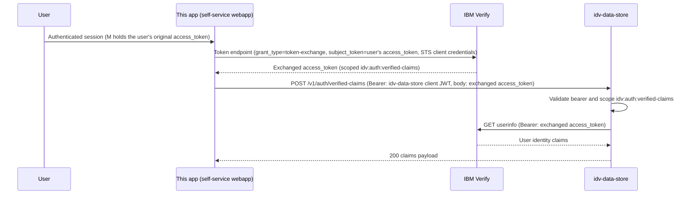

# IBM Verify RFC 8693 Token Exchange Flow (idv-data-store integration)

This document describes how this app (the self-service webapp / "manage app")
exchanges a user's own access_token for one scoped to idv-data-store, and uses
it to retrieve the user's verified identity claims.

Status: Implemented and covered by unit tests.

> This document previously lived in the idv-data-store repo
> (`documentation/ibm_verify/ibm_verify_token_exchange_flow.md`). It moved
> here because this app now owns the actual RFC 8693 exchange call — see that
> file for the slimmer, idv-data-store-owned endpoint contract for
> `POST /v1/auth/verified-claims`.

## Objective

This app exchanges the user's own access_token with IBM Verify — using its
own dedicated OAuth STS client credentials — for a new access_token scoped
specifically to idv-data-store (RFC 8693 OAuth 2.0 Token Exchange).
idv-data-store then accepts that already-exchanged access_token, calls
userinfo, and returns the resulting identity claims to this app.

**idv-data-store never performs the token exchange itself, and never
receives the user's original, broadly-scoped access_token.** Only the
narrowly-scoped, audience-restricted exchanged token is shared with it. This
design minimizes the blast radius if idv-data-store were ever compromised —
it only ever holds a token limited to the `idv:auth:verified-claims` scope,
not the user's original session token.

This follows IBM Verify's own documented
["resource-to-resource communication"](https://docs.verify.ibm.com/verify/docs/oauth-20-token-exchange)
use case for token exchange — a form of impersonation where one service
(this app) needs to call a second, separate service (idv-data-store) on
behalf of the user, but the user's original token cannot/should not be
reused directly against that second service (it lacks the right scope, and
is sender-constrained to this app). This is effectively a business-to-business
impersonation scenario between the two services, brokered by IBM Verify as
the STS. See [References](#references) at the end of this document.

## Two independent credential systems

This flow involves two _separate_ OAuth clients that must not be confused:

1. **IBM Verify STS client** — a dedicated client (or OIDC application)
   registered in the IBM Verify tenant, used only by this app to perform the
   RFC 8693 exchange itself. Its "Custom scopes and API access" configuration
   is restricted to only ever mint the `idv:auth:verified-claims` scope —
   this is what makes the exchanged token usable for idv-data-store and
   nothing else, since IBM Verify has no `resource`/`audience` request
   parameter; scope restriction on the client is the mechanism that plays
   that role. Configured via `IDV_DATA_STORE_STS_CLIENT_ID` /
   `IDV_DATA_STORE_STS_CLIENT_SECRET`.
2. **idv-data-store's own registered client** — a `RegisteredClient` row
   bootstrapped via idv-data-store's `POST /v1/admin/clients` and used to
   obtain an idv-data-store-issued Bearer JWT via `POST /v1/admin/token`
   (scoped to `idv:auth:verified-claims`). This is idv-data-store's own,
   unrelated client-authentication system. Configured via
   `IDV_DATA_STORE_CLIENT_ID`.

## Sequence

## Implementation Details

Execution path (all in this repo):

1. `backend/app/idv_data_store/v1_router.py` receives `GET /verified-claims`,
   resolves the user's session access_token via `get_users_current_session`,
   and calls `get_verified_identity_claims(...)`.
2. `backend/app/idv_data_store/services/verified_claims.py`:
   - `exchange_token_for_idv_data_store()` performs the RFC 8693 exchange
     against IBM Verify's `/oauth2/token` endpoint using the STS client
     credentials, returning the idv-data-store-scoped access_token.
   - `get_idv_data_store_client_token()` obtains idv-data-store's own
     client-bootstrap Bearer token via `POST /v1/admin/token`.
   - `dispatch_get_verified_claims_from_idv_data_store()` calls
     idv-data-store's `POST /v1/auth/verified-claims` with both tokens.
   - `get_verified_identity_claims()` orchestrates all of the above and
     returns the claims wrapped in a `ResponseModel`.

This app never shares the user's original, broadly-scoped access_token with
idv-data-store — only the narrowly-scoped, exchanged token from step 2 is
sent to it.

## Required IBM Verify Setup

Configuration lives on **this app's** STS client / OIDC application, not on
idv-data-store's own OIDC application:

1. Create a dedicated STS client (Applications → STS clients → Add STS
   client) or enable the Token Exchange grant type on this app's existing
   OIDC application.
2. Under "Custom scopes and API access", enable "Restrict custom scopes" and
   add exactly one custom scope: `idv:auth:verified-claims`. This is what
   restricts the client to only ever mint tokens usable against
   idv-data-store — IBM Verify has no `resource`/`audience` parameter; this
   scope allow-list is the mechanism that plays that role.
3. This app performs the exchange against IBM Verify's `/oauth2/token`
   endpoint using its own `client_id`/`client_secret`,
   `subject_token=<user's original access_token>`,
   `subject_token_type=urn:ietf:params:oauth:token-type:access_token`,
   `requested_token_type=urn:ietf:params:oauth:token-type:access_token`,
   and `scope=idv:auth:verified-claims`.

See [SCOPES.md](https://github.com/cds-snc/canadalogin-idv-data-store/blob/main/documentation/SCOPES.md)
in the idv-data-store repo for the full, canonical list of every scope
idv-data-store enforces (including this one) in a copy-paste-ready format.

## Environment Variables Used

Configured in `backend/app/config.py` (`IdvDataStoreConfig`) — see
`backend/.env.example` for the full list:

- `IDV_DATA_STORE_BASE_URL`
- `IDV_DATA_STORE_CLIENT_ID`
- `IDV_DATA_STORE_STS_CLIENT_ID`
- `IDV_DATA_STORE_STS_CLIENT_SECRET`
- `IDV_DATA_STORE_SCOPES`

(`IBM_VERIFY_TENANT_URL` is this app's existing, shared IBM Verify tenant
setting, also used for the STS token endpoint.)

## Error Handling Behavior

| Failure                                                  | Behavior                                                          |
| -------------------------------------------------------- | ----------------------------------------------------------------- |
| IBM Verify token exchange fails / missing `access_token` | Handled by `RequestErrorHandler`, raised as an application error. |
| idv-data-store client token request fails                | Handled by `RequestErrorHandler`, raised as an application error. |
| idv-data-store `verified-claims` request fails           | Handled by `RequestErrorHandler`, raised as an application error. |

idv-data-store itself intentionally returns a generic `502` for its own
upstream (IdP) failures and does not leak raw IdP error internals in the
response body — see idv-data-store's
[ibm_verify_token_exchange_flow.md](https://github.com/cds-snc/canadalogin-idv-data-store/blob/main/documentation/ibm_verify/ibm_verify_token_exchange_flow.md)
for its full error table (`401`/`403`/`422`/`502`).

## Verification and Debugging

Automated coverage:

- `backend/tests/test_idv_data_store_verified_claims.py`

Manual end-to-end check:

- Postman collection [GC_Sign_In_DEV.postman_collection.json](../postman/GC_Sign_In_DEV.postman_collection.json),
  folder `IDV Data Store - Token Exchange Flow` — see
  [docs/postman/README.md](../postman/README.md) for setup steps.

## References

- [IBM Verify: OAuth 2.0 Token Exchange](https://docs.verify.ibm.com/verify/docs/oauth-20-token-exchange) —
  the vendor documentation this implementation is based on. In particular,
  the "Resource-to-resource communication" use case under "Impersonation"
  describes exactly the business-to-business impersonation scenario used
  here: this app exchanges the user's access_token for a new, narrowly-scoped
  token to call a second protected resource (idv-data-store) on the user's
  behalf.
- [RFC 8693: OAuth 2.0 Token Exchange](https://datatracker.ietf.org/doc/html/rfc8693) —
  the underlying IETF standard IBM Verify's token exchange grant type
  implements.
