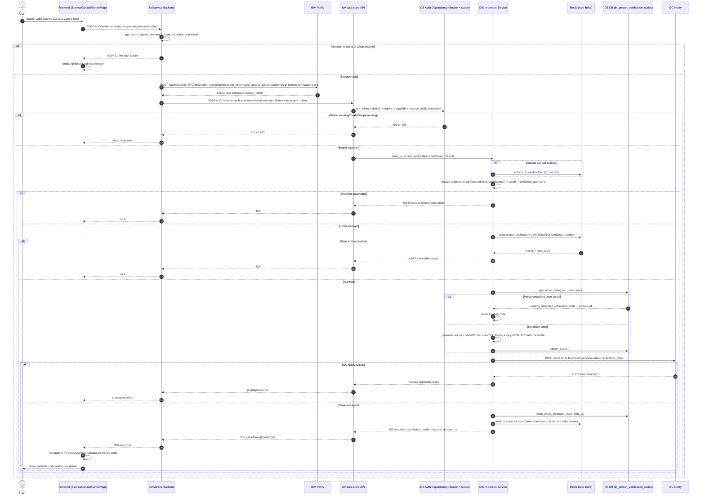

# In-person Identity Verification Code Generation Flow

This document captures the end-to-end sequence for in-person verification code generation across:

- selfservice webapp frontend
- selfservice backend
- idv-data-store

It focuses on the Service Canada Centre in-person path that calls:

- frontend -> `POST /v1/identity-verification/in-person` (selfservice backend)
- backend -> `POST /v1/in-person-verification/send` (idv-data-store)

## Sequence Diagram

## Notes

- This flow is delegated-bearer only for idv-data-store in-person endpoints. The backend exchanges the user token first, then sends only the exchanged token to idv-data-store as `Authorization: Bearer ...`.
- Form fields entered on the Service Canada Centre page are used for frontend validation and display state on the code page. The code-generation identity for email delivery is derived from delegated token claims in idv-data-store.
- The same send endpoint is also used by the in-person pending page "resend" action, so resend attempts go through the same cooldown/daily/IP throttles.

## Related Files

- Frontend API client: `frontend/src/features/IDV/api/inPersonIdentityVerificationApi.ts`
- Frontend Service Canada page: `frontend/src/features/IDV/InPerson/ServiceCanadaCentrePage.tsx`
- Backend route: `backend/app/identity_verification/v1_router.py`
- Backend in-person service: `backend/app/identity_verification/services/in_person_identity_verification.py`
- Backend base data store service: `backend/app/identity_verification/services/base_idv_data_store_service.py`
- Backend token exchange: `backend/app/identity_verification/services/token_exchange.py`
- idv-data-store route: `app/in_person_verification/router.py`
- idv-data-store service: `app/in_person_verification/services/send_in_person_verification_code.py`
- idv-data-store auth dependency: `app/security/auth.py`
- idv-data-store repository/model: `app/in_person_verification/repository.py`, `app/in_person_verification/models.py`
