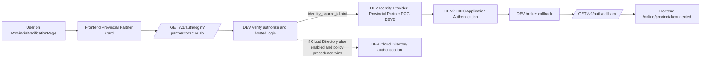

# Provincial Partner Identity Linking (DEV broker + DEV2 IdP)

## Purpose

This document captures the implementation and testing work completed for provincial partner sign-in where:

- DEV tenant is the broker and application-facing OIDC tenant.
- DEV2 tenant is the external OIDC identity provider used for provincial partner authentication.

It also documents current limitations and next steps.

## Scope covered in this document

1. DEV2 OIDC application setup.
2. DEV identity provider setup (pointing to DEV2).
3. How DEV app and DEV identity provider were linked.
4. How frontend and backend were integrated.
5. Current issue: reliable routing to DEV2 when Cloud Directory is also enabled.

## High-level architecture

## Completed setup

## 1) DEV2 OIDC application setup

In DEV2 tenant, an OIDC app was configured for brokered login from DEV.

Configuration highlights:

- OIDC client created in DEV2.
- Redirect URI allowlist updated to include the DEV broker redirect URI.
- Entitlements configured for test users (or temporary broad access during testing).

Observed errors and resolutions:

- `CSIAQ0167E` (redirect URI mismatch): fixed by adding exact DEV redirect URI to DEV2 app.
- `CSIAQ0279E` (user not entitled): fixed by assigning access/entitlement in DEV2 app.

## 2) DEV identity provider setup

In DEV tenant, an identity provider named similar to `Provincial Partner POC DEV2` was configured.

Configuration highlights:

- Type: OIDC enterprise provider.
- Issuer/well-known/authorize/token/userinfo endpoints point to DEV2 tenant.
- Provider enabled.
- Identity provider ID recorded and used by backend as the source hint value.

## 3) Linking DEV app to DEV identity provider

In DEV tenant OIDC app (main app):

- Sign-on policy includes supported identity providers.
- Provincial provider can be enabled.
- Cloud Directory can also be enabled.

Critical behavior discovered:

- When only provincial provider is enabled, provincial flow reliably reaches DEV2.
- When Cloud Directory is also enabled, hosted login may default to DEV Cloud Directory depending on policy precedence, even when source hint is sent.

## 4) Frontend and backend integration

### Frontend

Provincial partner cards in:

- `frontend/src/features/IDV/Online/ProvincialVerificationPage.tsx`

Behavior:

- BC and AB card clicks call backend login endpoint with partner key.
- `returnToPage` points to provincial connected page.
- Nested `returnToPage` propagation bug was fixed by stripping existing `returnToPage` from query params before building the next login URL.

### Backend

Main login handler:

- `backend/app/auth/services/auth.py`
- `redirect_user_to_idp_verify(request, prompt, returnToPage, partner)`

Behavior:

- Validates partner key.
- Maps partner to configured provincial identity provider ID.
- Sends `identity_source_id` as extra authorize parameter.
- Stores return path in session.

Callback handler:

- Fixed nested redirect issue by redirecting directly to stored `returnToPage` path instead of appending `returnToPage` query to itself.

## 5) Testing and validation completed

End-to-end observations:

- Provincial click correctly calls `/v1/auth/login?...&partner=bcsc`.
- DEV authorize redirect includes source hint and callback params.
- Callback reaches `/v1/auth/callback` and redirects to frontend connected page.
- DEV2 metrics can show authentication events when policy is constrained appropriately.

Automated tests:

- Backend auth tests in `backend/tests/test_auth.py` were kept green during changes.
- Frontend provincial page tests were updated for link-building and query behavior.

## Current known limitation

Requirement:

- Clicking BCSC/AB card should always route to the corresponding provincial provider flow.

Current reality with main DEV app policy:

- If Cloud Directory is enabled alongside provincial providers, routing can be non-deterministic in hosted login.
- `identity_source_id` behaves like a hint in this setup, not a strict guarantee.

## Why this happens

- Source selection is strongly influenced by DEV OIDC app sign-on policy and hosted login behavior.
- Redirect URI settings and group membership source settings do not enforce provider choice.
- App policy isolation is the most deterministic control point.

## Recommended next steps

Option A (recommended for deterministic behavior):

- Use dedicated OIDC app policy isolation for provincial flow, separate from main sign-in flow.
- Keep Cloud Directory on main app.
- Constrain provincial flow app to provincial providers only.

Option B (strongest deterministic isolation):

- One OIDC app per provincial provider (for example BC app, AB app).
- Backend maps partner to corresponding app login flow.

Option C (keep current app and hints):

- Keep `identity_source_id` hint approach.
- Accept potential non-deterministic provider selection when multiple providers are enabled.

## Notes for future contributors

- Treat `identity_source_id` behavior as tenant-observed behavior unless IBM provides explicit precedence documentation for the exact hosted login path.
- Always validate with both browser network traces and tenant audit/metrics.
- Keep return path handling clean to avoid nested `returnToPage` loops.
